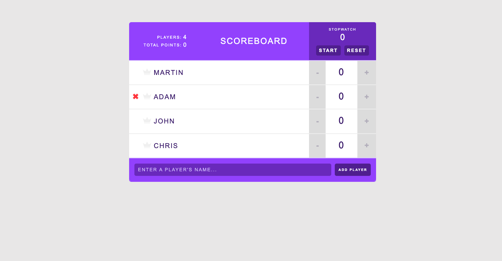
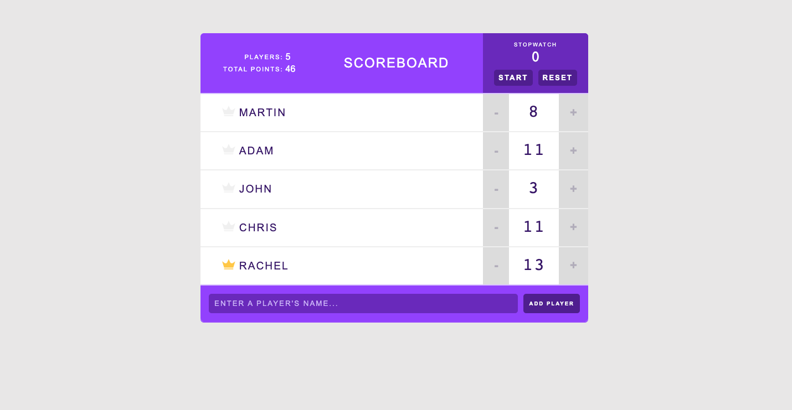

# scoreboard

A scoreboard app built with React

## Example

## index.js

    index.js is the main entry point of the application. Importing react, reactDOM and the App.js component and rendering it to the DOM in the root div.

## Components

### App.js

    App.js is the main component of the application. It is structured as a React Class Component and holds the the main application state. Storing the initalized players array, and main functions handling the removal and addition of players, scorechanges, and highest score stats.

### Player.js

    Player.js is a React PureComponent (so that it does not unnecessarily rerender when a specific player state has no changes). It returns the HTML required to display a player and imports the Icon and Counter components.

### Counter.js

    Counter.js is a functional component that returns the HTML to display the score and score buttons. It also sends back score changes and alters the new high score through call back functions passed down as props.

### AddPlayerForm.js

    AddPlayerForm is a functional component that uses props and refs. It returns HTML for a form in order to add new players to the scoreboard passing the new player's name from the input ref to a callback function.

### Stopwatch.js

    Stopwatch.js is a react class standalone component. Meaning it does not need any information from any other part of the application to run. It has its own state, functions and uses hooks. The componentDidMount() hook is used to start the timer and uses the componentWillUnmount to clear any memeory leaks if the component ever unmounts.

### Header.js

    Header.js, a functional component, simply returns a header title and calls on two components the Stats and Stopwatch components.

### Icon.js

    Icon.js is a functional component that simply returns a svg of the highscore crown using one prop to see if the badge should be displayed depending on the player's score.

### Stats.js

    Stats.js is a functional component that displays the total number of players and the total points of all players in the header of the app using the players prop passed to it.

- [scoreboard](#scoreboard)
  - [Example](#example)
  - [index.js](#indexjs)
  - [Components](#components)
    - [App.js](#appjs)
    - [Player.js](#playerjs)
    - [Counter.js](#counterjs)
    - [AddPlayerForm.js](#addplayerformjs)
    - [Stopwatch.js](#stopwatchjs)
    - [Header.js](#headerjs)
    - [Icon.js](#iconjs)
    - [Stats.js](#statsjs)
